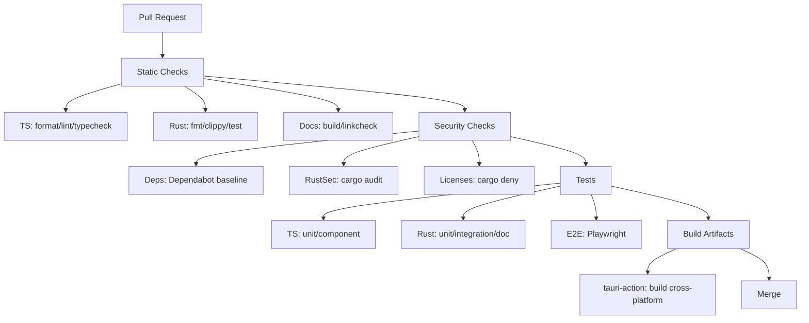
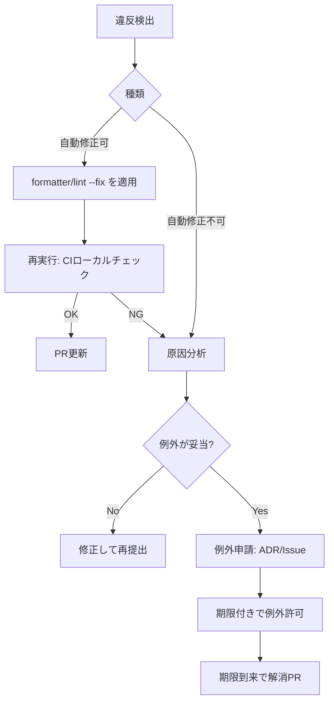

# TypeScript × Rust × SQLite × Tauri 向けコーディング規約書の包括設計

## エグゼクティブサマリ

本報告書は、**TypeScript（フロントエンド）**と**Rust（バックエンド）**、**SQLite（ローカル永続化）**、**Tauri（デスクトップアプリ基盤）**から成る構成を前提に、複数の公式ガイド・主要OSSスタイルガイド・業界標準を横断して、**「規約として明文化すべき項目」**を分析し、**規約案（目的・ルール・言語別例・自動化・チェックリスト・出典）**として体系化したものです。特に、Tauri v2は**WebView側のアクセスをIPCで制御し、Capabilities/Permissionsで公開コマンドを制限する**というセキュリティ設計が中核にあるため、規約は「TS/Rustの見た目」だけでなく、**境界（IPC/DB/ファイル/ネットワーク）での入力検証・権限・ログ**を中心に据えるべきです。citeturn22search10turn22search2turn2search1turn8search2

推奨する「規約の設計方針」は次の3点です。第一に、**フォーマットは人間が議論せずツールで強制**します。Prettierはスタイル論争を止めることを主要目的として掲げており、Rust側もrustfmt（デフォルトスタイル）で一貫性を得ることが生産性・理解容易性に寄与すると説明されています。citeturn24search2turn24search1turn21view0 第二に、**型と境界でバグを止める**ため、TypeScriptは`strict`を原則ON（必要なら個別に調整）とし、Rustは`Result`型・Clippy・APIガイドライン準拠でエラー表現を統一します。citeturn16search0turn1search2turn22search4 第三に、**CI/CDで規約を「品質ゲート」に変換**し、レビューは「ロジックと安全性」に集中させます（GoogleのCode Review指針も、コードレビューの目的をコードベースの健全性改善に置いています）。citeturn12search0turn11search4turn25search4

本書の成果物として、(1) 規約項目を「考慮すべき属性／次元」として明示した上で、(2) TS/Rust/SQLite/Tauriに最適化した具体ルール、(3) 自動化ツール推奨、(4) CI/CDとレビュー運用、(5) 違反時の対応フロー（Mermaid）とチェックリスト、(6) そのまま転記できるテンプレート要素を提示します。citeturn15view2turn12search0turn11search4turn24search2

## 対象範囲と設計原則

### 対象システムの前提

本規約が想定する構成は以下です。

- UI/フロントエンド：TypeScript（WebView上で実行）
- バックエンド：Rust（Tauriのコマンドとして公開）
- 永続化：SQLite（ローカルDB）
- アプリ基盤：Tauri v2（Capabilities/Permissions、CSPなどのセキュリティ機能を利用）

Tauriは「WebView内コードは公開されたIPC経由でのみシステム資源にアクセスでき、公開コマンドはCapabilitiesで制限する」という整理を公式に示しています。citeturn22search10turn22search2turn2search1

### 規約書の目的と設計思想

規約書の最終目標は、**コードの可読性・保守性・安全性を、個人の熟練度ではなくプロセスと自動化で担保**することです。スタイルはツール化によりレビューの論点から外し、レビューは設計・境界・例外系・セキュリティに集中させます。Prettierは「スタイル論争を止める」ことを採用理由の中心に置き、Rust側も既定スタイルへの整形が理解コストを下げると説明しています。citeturn24search2turn21view0

加えて、セキュリティ要件は「後付けの脆弱性診断」ではなく、開発成果物としての**セキュアコーディングチェックリスト**に落とし込むのが現実的です。ASVS（日本語版）も、ASVSを**組織やアプリに固有のセキュアコーディングチェックリスト作成の青写真として使う**ことを推奨しています。citeturn15view2turn14view0

### 考慮すべき属性／次元

以下は、規約書で必ず扱うべき「属性／次元」です（右列は本スタックに即した観点）。

| 次元 | 本スタックでの適用ポイント |
|---|---|
| 対象言語 | TypeScript（フロント）、Rust（バック）、SQL（SQLite）citeturn23search1 |
| フレームワーク／基盤 | Tauri v2（Capabilities/Permissions、CSP、コマンドシステム、公式プラグイン）citeturn2search2turn22search2turn8search2turn10search4 |
| 命名規則 | TSはGoogle TS Styleの分類（UpperCamelCase/lowerCamelCase/CONSTANT_CASE等）、RustはRust Style Guideの原則に整合citeturn20view0turn21view0 |
| ファイル・ディレクトリ構成 | `src/` と `src-tauri/`、`src-tauri/capabilities`、設定ファイル `tauri.conf.json` の管理citeturn26search9turn26search1turn22search14 |
| コードスタイル | TSはPrettier、Rustはrustfmt（既定: 最大行幅100等）citeturn24search2turn21view0turn17search10 |
| コメント・ドキュメンテーション | TSはTSDoc/JSDoc（TS公式JSDoc対応）とAPI方針、RustはrustdocとAPIガイドラインciteturn9search4turn9search1turn9search2turn9search7 |
| API設計 | Tauriコマンド境界（引数/戻り値/エラー/async）、IPCの権限スコープ設計citeturn2search2turn2search1turn22search2 |
| エラーハンドリング・例外処理 | TSは「Errorのみ投げる」、RustはDisplayメッセージ規約等citeturn18view0turn22search4 |
| ログ | Tauri公式logプラグイン（既定ターゲット、フロント連携）＋構造化の方針citeturn10search4turn24search3turn10search0 |
| セキュリティ | TauriのCSP/Capabilities/Permissions、OWASP Top 10・ASVSを要求として採用citeturn8search2turn22search2turn8search3turn15view2 |
| テスト | Rustは`cargo test`（ユニット/統合/ドキュメント）、TSはVitest、E2EはPlaywright等citeturn6search2turn6search0turn6search1turn9search17 |
| CI/CD | GitHub Actions＋tauri-actionでビルド/リリース、GITHUB_TOKEN最小権限citeturn11search4turn11search0turn25search4 |
| 依存管理 | `Cargo.lock`・`package-lock.json`/`pnpm-lock.yaml`等のロックファイル運用、脆弱性/ライセンス監査citeturn4search0turn5search4turn5search1turn4search1turn11search11 |
| パフォーマンス最適化 | ベンチマーク（Criterion）、SQLiteのWAL/トランザクション設計citeturn6search3turn3search1turn23search3 |
| 可観測性 | ログ/メトリクス/トレースの相関（OpenTelemetry）、Trace Context等citeturn10search1turn10search9turn10search2 |
| リファクタリング基準 | 変更単位を小さく、レビュー可能性とコードヘルスを優先citeturn12search0turn12search11 |
| コードレビュー基準 | 「コードヘルス改善」が目的、コメント作法、Small CLの推奨citeturn12search0turn12search8turn12search11 |
| アクセシビリティ | WCAG 2.2（日本語訳）とWAI-ARIA APGに基づくUI設計・実装citeturn13search0turn13search1 |
| 国際化 | Unicode正規化、i18n設計チェックリスト（W3C）citeturn13search2turn13search15turn13search3 |
| ライセンス/著作権 | SPDX識別子、依存ライセンスの許容判定（cargo-deny等）citeturn12search3turn11search11turn11search15 |
| サンプルテンプレート／チェックリスト／違反対応 | ASVSの「チェックリスト化」思想＋CI/レビュー/例外申請フローの明文化citeturn15view2turn12search0turn11search4 |

## リポジトリ構成と命名規則

### 推奨ディレクトリ構成

Tauriはプロジェクト作成時に`src-tauri`を作成し、必要な設定ファイルをそこへ置くことを明示しています。citeturn26search9turn26search1 これを踏まえ、規約書では「関心の分離（Front/Back/Shared/DB/CI）」をコード構造で表現します。

**推奨ツリー（例）**：

```text
.
├─ src/                       # TypeScript: UI/フロントエンド
│  ├─ app/                    # 画面/状態/機能単位
│  ├─ components/             # UI部品（アクセシビリティもここで担保）
│  ├─ features/               # ユースケース単位（ドメイン寄り）
│  ├─ lib/                    # 汎用ユーティリティ
│  ├─ bridge/                 # Tauri invoke / plugin ラッパ
│  ├─ i18n/                   # 翻訳・ロケール
│  └─ main.ts                 # エントリ
├─ src-tauri/                 # Rust: Tauri バックエンド
│  ├─ src/
│  │  ├─ main.rs              # エントリ
│  │  ├─ commands/            # #[tauri::command] を集約
│  │  ├─ domain/              # ドメインモデル（純粋ロジック）
│  │  ├─ infra/               # DB/FS/HTTP など外部I/O
│  │  └─ telemetry/           # logging/tracing など
│  ├─ capabilities/           # v2 Capabilities 定義
│  ├─ tauri.conf.json         # 設定（生成される）
│  ├─ Cargo.toml
│  └─ Cargo.lock
├─ migrations/                # DBマイグレーション（sqlite/sqlx方針時）
├─ .github/workflows/         # CI/CD
└─ docs/                      # 規約書、ADR、設計資料
```

Capabilities定義は`src-tauri/capabilities`配下にJSON/TOMLで置けることが（日本語ドキュメントでも）示されています。citeturn22search14turn2search1

### 命名規則

#### TypeScript 命名規則

TypeScript側は、Google TypeScript Style Guideの命名分類をベースラインにすると、レビュー観点が明確になります。具体的には、識別子の種別ごとに`UpperCamelCase`（class/interface/type/enum等）、`lowerCamelCase`（変数/関数/メソッド等）、`CONSTANT_CASE`（グローバル定数等）を使い分け、`_`のprefix/suffixは禁じています。citeturn20view0turn20view1

**規約（TS）**  
目的：型情報と命名の二重表現を避け、初見の読者に誤解されない命名を徹底する。citeturn20view0

- `UpperCamelCase`: `class`, `interface`, `type`, `enum`, React/TSXのコンポーネント関数名
- `lowerCamelCase`: 変数・関数・メソッド・プロパティ
- `CONSTANT_CASE`: 「変更されない意図」を示す定数（特にモジュールレベル）citeturn20view0
- 例外的にテスト名では`testX_whenY_doesZ`のような`_`区切りが許容される（xUnit系）citeturn20view0

**TS例（命名）**：

```ts
// CONSTANT_CASE: モジュールレベルの定数
export const DEFAULT_TIMEOUT_MS = 5_000;

export interface UserProfile {
  userId: string;
}

export function loadUserProfile(userId: string): Promise<UserProfile> {
  // ...
  return Promise.resolve({ userId });
}
```

#### Rust 命名規則

Rust側はRust Style Guideを既定として採用し、rustfmt準拠の書式・命名で統一します。Rust Style Guideは「デフォルトRustスタイル」を定義し、ツール（rustfmt）が参照すると述べています。citeturn21view0turn1search4

**規約（Rust）**  
目的：エコシステム標準の慣習に一致させ、読み手の期待と差分を最小化する。citeturn21view0

- まずは**デフォルトスタイル（rustfmt標準）**を基本とし、例外設定は最小化する（スタイル議論はコストが高い）citeturn21view0turn24search1
- インデント・最大行幅等はRust Style Guideに合わせる（後述）citeturn21view0

## コードスタイルとドキュメント規約

### 書式の強制方針

#### TypeScript 書式

TypeScriptの整形はPrettierを基準とし、「見た目の議論をレビューから除外」します。Prettierは採用理由として、スタイル論争を止める（nitの応酬を減らす）ことを明示しています。citeturn24search2

- `printWidth`: 100（Rust側100と揃える運用が一貫しやすい）  
  ただしPrettier自身が、`printWidth`は**上限ではなく目安**であると説明しています。citeturn17search1turn17search12
- `tabWidth`: 2（Web系標準的運用を採用、必要なら変更可能）
- `semi`, `singleQuote`, `trailingComma`等はチーム標準を固定（差分ノイズ削減）

**Prettier設定例（抜粋）**：

```js
// prettier.config.cjs
module.exports = {
  printWidth: 100,
  tabWidth: 2,
  singleQuote: true,
  trailingComma: 'all',
};
```

#### Rust 書式

RustはRust Style Guideを採用し、rustfmtで強制します。Rust Style Guideは、インデントはスペースで4、最大行幅は100と定義しています。citeturn21view0 さらにrustfmtの`max_width`も既定が100であることが示されています。citeturn17search10

**rustfmt設定方針**  
目的：既定スタイル維持（エコシステムとの互換性）と、差分の安定化。citeturn21view0turn24search1

- 原則：`cargo fmt`で整形し、設定は最小限
- 2024 EditionではStyle Editionの概念が導入され、rustfmtが使うスタイルエディションを制御可能（必要なら追随方針を規約に明記）citeturn16search3turn16search7

### コメント・ドキュメンテーション

#### TypeScript: TSDoc/JSDoc

TypeScriptのAPIコメントは「機械が読み取れる形式」で統一し、ドキュメント生成・公開境界（public API）に使います。TSDocはTypeScript向けdoc commentsを標準化する提案であると説明しています。citeturn9search4turn9search0 またTypeScript公式はJSDocのサポート範囲を公開しており、タグや型表現には制約があるため「規約として採用するタグセット」を固定するのが安全です。citeturn9search5turn9search1

**規約（TSドキュメント）**  
目的：公開APIの説明責務を明確化し、変更容易性を上げる（破壊的変更の検出、型と文書の一致）。citeturn5search3turn9search4

- `export`する関数/型/コンポーネントはTSDoc（またはJSDoc互換）で「目的・副作用・例外系・境界条件」を記述
- `@internal`相当の非公開APIはドキュメント生成対象から除外（ツールチェーン側で扱いを統一）citeturn9search18

**TS例（TSDoc）**：

```ts
/**
 * ユーザー設定を保存する。
 *
 * @remarks
 * 永続化層は呼び出し元に隠蔽される。失敗時はErrorを投げる。
 */
export async function saveUserSettings(payload: unknown): Promise<void> {
  // ...
}
```

#### Rust: rustdocとAPIガイドライン

Rustでは、公開アイテムは文書化すべきである（public itemはdocument）という方針がrustdoc bookに明記されています。citeturn9search2 Rust By Exampleもdoc commentsは`rustdoc`で文書にコンパイルされると説明しています。citeturn9search3 またRust API Guidelinesは、crateレベルのドキュメントや例の充実を求める指針を提供しています。citeturn9search7

**規約（Rustドキュメント）**  
目的：Rust側の公開API（commands、domain、infraの公開境界）をドキュメントテスト込みで保守する。citeturn9search2turn9search17

- `pub`アイテムは原則`///`でdoc commentを付与
- 例はdoc testとして実行可能にする（コピー&ペースト可能な形）citeturn9search17

**Rust例（rustdoc）**：

```rust
/// ユーザー設定を保存する。
///
/// # Errors
/// 永続化に失敗した場合にエラーを返す。
pub fn save_user_settings() -> Result<(), SaveError> {
    // ...
    Ok(())
}
```

### 例外処理と例外コメントの規約

#### TypeScript: 「Errorのみ投げる」と`unknown`受け

Google TypeScript Style Guideは、任意値をthrow/rejectするとスタックトレースが得られずデバッグが困難になるため、**Error（またはそのサブクラス）のみを投げる**ことを求めています。citeturn18view0

**規約（TS例外）**  
目的：例外観測（ログ/スタック）を一貫させ、例外系の仕様を明確にする。citeturn18view0turn22search5

- `throw new Error(...)` を基本（`Error()`より`new`を推奨）citeturn18view0
- `catch (e)` は `unknown` とし、Errorであることをアサートして扱う（境界の型安全性）citeturn18view0

**TS例（例外ガード）**：

```ts
function assertIsError(e: unknown): asserts e is Error {
  if (!(e instanceof Error)) throw new Error('unexpected non-Error thrown');
}

try {
  doSomething();
} catch (e: unknown) {
  assertIsError(e);
  console.error(e.message);
  throw e;
}
```

#### Rust: エラーメッセージ形式と連鎖

Rust API Guidelinesは、`Display`で表示するエラーメッセージは「小文字で、末尾に句読点を付けず、簡潔に」と明示しています。citeturn22search4turn22search0

**規約（Rustエラー）**  
目的：ユーザー向け/ログ向けのメッセージ整形を統一し、原因（source）を連鎖させて診断可能性を上げる。citeturn22search4turn1search2

- `Display`メッセージ：lowercase + no trailing punctuation + conciseciteturn22search4
- `Error::description()`は非推奨で実装しない（ガイドラインで言及）citeturn22search4

## API設計・エラーハンドリング・ログ・セキュリティ

### Tauri境界のAPI設計

Tauri v2は、フロントエンドからRust関数を呼ぶために**commandシステム**を提供し、コマンドは引数/戻り値を取り、`async`やエラーも扱えると説明しています。citeturn2search2 この境界は「実質的にAPI」であるため、規約では以下を固定します。

**規約（Tauriコマンド設計）**  
目的：IPC境界の破壊的変更を抑制し、権限・入力検証・監査ログを一元化する。citeturn2search2turn22search2turn8search3

- **コマンド名は安定識別子**として扱い、後方互換を意識（変更は段階的に）
- 入力は`unknown`相当で受け、境界でバリデーション（後述：OWASP/ASVS）
- 戻り値は「成功/失敗」を必ず区別し、失敗は構造化（エラーコード・ユーザー向けメッセージ・内部詳細）

**Rust例（コマンドの形）**：

```rust
#[tauri::command]
async fn save_settings(payload: serde_json::Value) -> Result<(), AppError> {
    // 1) validate payload
    // 2) authorize by capability scope if necessary
    // 3) persist to sqlite
    Ok(())
}
```

### Capabilities/Permissionsでの公開面積制御

TauriはCapabilitiesシステムにより、WebViewへ公開するコア機能を「粒度高く有効化・制約する」ことができると述べています。citeturn22search2turn2search1 さらに、日本語ドキュメントでもCapabilitiesファイルが`src-tauri/capabilities`に置かれることが示されています。citeturn22search14

**規約（権限設計）**  
目的：最小権限の原則で「必要なコマンドだけを公開」し、誤公開や将来の機能拡張による露出増を抑制する。citeturn22search6turn22search2turn8search16

- Capabilitiesは「ウィンドウ/ウェブビュー単位」でスコープ化し、管理をコードレビュー対象にする
- 公式プラグインも権限（permissions）で有効化し、使わない権限は付けないciteturn8search16turn2search1

### Content Security Policy

TauriはCSPを制限し、XSS等の一般的なWeb脆弱性の影響を抑えるために利用できると説明しています。またローカルスクリプトのハッシュ化やnonceによる外部スクリプト制御に言及しています。citeturn8search2

**規約（CSP）**  
目的：WebView起点の攻撃面（XSS・任意スクリプト注入）を最小化する。citeturn8search2turn8search3

- 原則として**厳格CSP**（`unsafe-inline`や`eval`相当を避ける）
- 例外的に緩める場合は「理由・期間・代替策」をADR等で残す

### SQLite設計・クエリ規約

#### 外部キーと整合性

SQLiteの外部キー制約は、後方互換の理由でデフォルト無効であり、**接続ごとに有効化が必要**という整理（公式文言の引用を含む議論）が広く共有されています。citeturn22search3turn3search0turn3search18 規約としては「アプリ起動時とコネクション初期化時に必ず`PRAGMA foreign_keys = ON`を実行」を固定します。

#### WALと同時実行

SQLiteのWALモードは `PRAGMA journal_mode=WAL;` で切り替えられることが公式に示されており、同期設定の挙動もPRAGMAドキュメントで解説されています。citeturn3search1turn3search4

**規約（SQLite運用）**  
目的：ローカルDBにおける性能・整合性・運用再現性を確保する。citeturn3search1turn3search0

- `PRAGMA foreign_keys = ON` を接続確立直後に実行
- 可能ならWALモードを採用（ただしバックアップ/ファイル運用の特性を理解した上で）citeturn3search1turn3search4
- 競合が問題になる書き込みはトランザクションモード（例：`BEGIN IMMEDIATE`）を使い、`SQLITE_BUSY`の扱い（リトライ/ユーザー通知）を方針化するciteturn23search3turn23search7

#### SQLインジェクションとバインド

プレースホルダ＋バインドはSQLiteのプリペアドステートメント手順として公式に説明されています（prepare→bind→step→reset→finalize）。citeturn3search9turn3search2 Rustのsqlxも`bind()`でパラメータをバインドでき、数が不一致なら実行時にエラーになると説明しています。citeturn3search10turn23search0

**規約（SQL）**  
目的：文字列結合による注入・構文崩れを排除し、ログと調査可能性を上げる。citeturn3search9turn3search10turn8search3

- SQLは必ずバインド変数を使用し、ユーザー入力を文字列連結しない
- 複雑な更新はトランザクションでまとめる

### ログ設計と可観測性

#### Tauri公式ログプラグイン

Tauri v2のlogプラグインは、ログレベルや関数（`info/debug/trace`等）、コンソールへのアタッチなどを提供します。citeturn10search0 またRust側のログターゲットはデフォルトでstdoutとログディレクトリへのファイル出力であることが示されています。citeturn24search3turn10search4

**規約（ログ）**  
目的：障害対応・調査・監査（セキュリティログ）を可能にし、ユーザーへの過剰露出（機微情報）を防ぐ。citeturn8search3turn24search4turn10search4

- ログは「構造化（key-value）」を基本（Tauri logの`keyValues`のような仕組みも活用）citeturn10search0
- PII/秘密情報（トークン、パスワード、鍵）はログに出さない（OWASPのログ/監視失敗を含む観点）citeturn8search3turn24search4

#### OpenTelemetry と相関

OpenTelemetry仕様は、Collectorがトレース・メトリクス・ログ等のテレメトリを収集・変換・エクスポートできることを説明し、ログにもResource等のコンテキストを含めることで相関を実現する方向性を示しています。citeturn10search1turn10search9 分散トレースの伝播にはW3C Trace Contextの`traceparent`等が標準化されています。citeturn10search2turn10search6

**規約（可観測性）**  
目的：TS⇄Rust⇄DBの処理連鎖を「同一要求（操作）」として追跡可能にする。citeturn10search2turn10search9

- 操作ID（correlation id）をUI起点で採番し、Rust側コマンド・DB更新ログへ引き継ぐ
- trace/spanの概念を導入する場合は、仕様（Trace Context）に沿った伝播を検討するciteturn10search2turn10search1

### セキュリティ規約の体系

#### 要求セットとしてのOWASP Top 10 / ASVS

OWASP Top 10（日本語ページ）は主要リスクの整理を提供し、ASVSはWebアプリの技術的セキュリティ制御のテスト基盤・要求リストを提供すると説明しています。citeturn8search3turn24search16 またASVS日本語版では、ASVSを「固有のセキュアコーディングチェックリスト作成の青写真」として使うことが述べられています。citeturn15view2turn14view0

**規約（セキュリティ）**  
目的：セキュリティを「非機能要求」ではなく「実装・レビュー・CIのチェック項目」に落とす。citeturn15view2turn8search3turn24search4

- 入力検証（schema validation）・認証/権限・秘密管理・エラーハンドリング/ログを必須領域として扱うciteturn24search4turn15view2
- TauriのPermissions/Capabilitiesはセキュリティ要件の第一級成果物（PRで差分レビュー必須）citeturn22search2turn2search1

## テスト戦略と品質ゲート

### テスト種別と配置

Rustは`cargo test`でテストを実行し、Cargoは`src`内をユニット/ドキュメントテスト、`tests/`を統合テストとして扱うと説明しています。citeturn6search2 さらにRust By Exampleでも統合テストの位置付けが述べられています。citeturn6search8turn6search11

TypeScript側は、Viteと設定を共有できる点を利点としてVitestが説明しています。citeturn6search0 E2EはPlaywrightがクロスブラウザ/クロスプラットフォームでのE2Eを提供すると説明しています。citeturn6search1turn6search14

**規約（テスト配置）**  
目的：テストの目的（ユニット/統合/E2E）を混同せず、失敗時に原因を切り分けやすくする。citeturn6search2turn6search0turn6search1

- Rust：ユニットは`src`内、統合は`tests/`、例はdoc test
- TS：ユニット/コンポーネントはVitest、E2EはPlaywright

### カバレッジと基準

VitestはV8/istanbulによるカバレッジ取得をサポートし、provider切り替え方法をドキュメント化しています。citeturn7search1turn7search5 Rustは`cargo-llvm-cov`がLLVMベースのカバレッジ計測ツールとして提供されています。citeturn7search8turn7search12

Codecovは設定により「一定閾値を満たさないとステータスを失敗にする」例を示しています。citeturn7search6

**規約（カバレッジ）**  
目的：未テスト領域を可視化し、変更に対する回帰推定の精度を上げる。citeturn7search1turn7search8turn7search6

- PR単位の「最低ライン」を設定（例：project 70%、PR差分80%など）
- 100%を機械的に強制するより、重要領域（境界、権限、暗号、エラー系）を優先する（ASVSの考え方と整合）citeturn15view1turn15view2turn7search6

### パフォーマンステスト

RustではCriterion.rsが統計駆動のベンチマークとして、回帰検知にも使えることを説明しています。citeturn6search3turn6search16 SQLiteはWALやトランザクションモードにより性能・競合特性が変わるため、DBを含む処理は「ベンチで守る」という規約が有効です。citeturn3search1turn23search3

## 運用自動化とガバナンス

### 自動化ツール推奨一覧

規約は「守る努力」ではなく「守られる仕組み」として整備します（ASVSがチェックリスト化を推奨する思想と整合）。citeturn15view2turn24search2

| 目的 | TypeScript | Rust | 共通 |
|---|---|---|---|
| フォーマット | Prettier（printWidth等）citeturn24search2turn17search12 | rustfmt（最大幅100等）citeturn21view0turn17search10 | CIで「差分ゼロ」確認 |
| Lint | ESLint + typescript-eslint（推奨config）citeturn0search8turn0search15 | Clippy（多数のlintカテゴリ）citeturn1search2turn1search6 | |
| 依存脆弱性 | npm/pnpm audit（運用に応じて） | cargo-audit（RustSec）citeturn4search1turn4search9 | Dependabot更新PRciteturn11search2turn11search6 |
| ライセンス監査 | packageライセンス収集 | cargo-deny（license check）citeturn11search11turn11search15 | SPDX識別子で明示citeturn12search3turn12search10 |
| ログ | Tauri log plugin（JS側API）citeturn10search0 | Tauri log plugin（デフォルトstdout+ファイル等）citeturn10search4turn24search3 | |

### CI/CDパイプライン方針

TauriはGitHub Actionsで`tauri-action`を使いビルド・アップロードする手順をガイドしており、同ActionはmacOS/Linux/Windows向けにビルドしGitHub Releaseへアップロード可能と説明されています。citeturn11search4turn11search0

GitHubはActionsのセキュア利用として、`GITHUB_TOKEN`には最小権限を付与し、必要に応じてジョブ単位で増やすべきと明示しています。citeturn25search4turn25search1

**推奨CIステージ**（例）：



このフローの根拠となる構成要素（tauri-action、Dependabot、cargo-audit、cargo-deny、cargo test、Vitest、Playwright、GITHUB_TOKEN最小権限）はそれぞれ公式に説明されています。citeturn11search4turn11search0turn11search2turn4search1turn11search11turn6search2turn6search0turn6search1turn25search4

### 依存管理の規約

RustはCargo Bookで「迷ったら`Cargo.lock`をVCSにチェックインすべき」と述べています。citeturn4search0 Node側もnpmドキュメントで`package-lock.json`はリポジトリにコミットする意図があると明示しています。citeturn5search4 pnpmも`pnpm-lock.yaml`を常にコミットすべきと明言しています。citeturn5search1

**規約（ロックファイル）**  
目的：CI/本番/開発で依存解決を一致させ、再現性を確保する。citeturn4search0turn5search4turn5search1

- `Cargo.lock`、`package-lock.json`または`pnpm-lock.yaml`は原則コミット
- パッケージマネージャを混在させない（lockfile衝突/混乱を避ける）

### コードレビュー基準

GoogleのCode Review指針は、コードレビューの目的を「コードベースの健全性が時間とともに改善すること」と定義しています。citeturn12search0 また小さな変更（Small CL）はレビュー品質と速度を上げると説明されています。citeturn12search11 コメント作法も「理由を説明する」「親切に」等が整理されています。citeturn12search8

**規約（レビュー観点）**  
目的：レビューをボトルネックではなく品質装置にする。citeturn12search0turn12search11

- 形式（フォーマット）はCIで落とし、レビューは設計・境界・例外・権限へ集中
- PRは原則Small（機能を分割し、ロールバック容易性を確保）

### アクセシビリティと国際化

WCAG 2.2（日本語訳）はウェブコンテンツのアクセシビリティ共通基準を提供する目的を説明し、WAI-ARIA APGはARIA仕様を用いた設計パターンと実装指針を提供します。citeturn13search0turn13search1 Tauri UIはWeb技術であるため、規約としてWCAG達成基準（重要なもの）をチェックリスト化し、コンポーネント単位で担保します。

国際化については、Unicode正規化（NFC/NFKC等）のアルゴリズムがUnicode標準で定義されており、入力・検索・比較を扱うUIでは正規化方針が不一致だと不具合やセキュリティ問題（同形異体の扱いなど）になり得ます。citeturn13search2 W3Cは国際化に関するクイックチップ等のガイダンスも提供しています。citeturn13search15turn13search3

### ライセンス・著作権

SPDX License Listは標準化された短い識別子や永続URLを含むと説明しています。citeturn12search3 依存関係のライセンス適合はRustではcargo-denyが「許容できるライセンス条件か」を検証する仕組みを提供します。citeturn11search11turn11search15

**規約（ライセンス）**  
目的：配布物（デスクトップアプリ）としてのコンプライアンスを保つ。

- 依存のライセンス監査（CIで`cargo deny check licenses`）
- ソースヘッダにSPDX表現を使う場合は表記規約（大文字小文字等）を合わせるciteturn12search10turn12search3

### 違反時の対応フロー

「規約違反」は、例外運用まで含めてプロセス化しないと形骸化します。ASVSも、ツールだけで半分以上は完了できず、テスト/レビューの組み合わせが必要と述べています。citeturn14view0turn15view1



このフローは、ASVSが「チェックリストとして仕立て直す」「自動化と人手を組み合わせる」思想と整合します。citeturn15view2turn15view1turn24search4

## サンプルテンプレートとチェックリスト

### 規約（コピペ可能な章立てテンプレート）

以下をそのまま「コーディング規約書」の目次として使える形にします。

- 目的・適用範囲（TS/Rust/SQL/Tauri、対象ブランチ、例外ルール）
- リポジトリ構成（`src`/`src-tauri`/`capabilities`/`migrations`）
- 命名規則（TS/Rust/SQLの命名、ファイル名、テーブル/カラム名）
- 書式（Prettier/rustfmt、最大行長、コメント長）
- ドキュメンテーション（TSDoc/rustdoc、公開APIの基準）
- API設計（Tauri command、データ構造、バージョニング方針）
- エラー処理（TS: Errorのみ、Rust: Display規約、ログ方針）
- ログ・可観測性（Tauri log、相関ID、OTel方針）
- セキュリティ（CSP、Capabilities、OWASP Top10/ASVS由来チェック）
- テスト（ユニット/統合/E2E、カバレッジ、回帰試験）
- CI/CD（GitHub Actions、tauri-action、最小権限）
- 依存管理（lockfile、Dependabot、cargo-audit、cargo-deny）
- アクセシビリティ・国際化（WCAG/APG、Unicode正規化）
- ライセンス（SPDX、配布時の注意）
- レビュー基準（Small PR、観点、合格条件）
- 違反時の対応（修正/例外申請/期限/再発防止）

### 実務チェックリスト

規約の「守られているか」は、PRテンプレやCIで使えるチェックリストに落とします。

| 分類 | チェック項目 | 自動化 | 目視 |
|---|---|---|---|
| 書式 | Prettier/rustfmt適用済み（差分なし）citeturn24search2turn21view0 | ✅ |  |
| 型 | TS `strict`方針に反していないciteturn16search0 | ✅（tsc） |  |
| 例外 | TSはErrorのみthrow、Rustはエラー文言規約を満たすciteturn18view0turn22search4 | 部分✅ | ✅ |
| 権限 | Capabilities/Permissions差分がレビューされ、最小権限citeturn22search2turn25search4 |  | ✅ |
| CSP | CSP変更は理由・影響・代替策が記録citeturn8search2 |  | ✅ |
| DB | foreign_keys有効化、バインド利用、トランザクション方針citeturn22search3turn3search9turn3search10turn23search3 | 部分✅ | ✅ |
| テスト | Rust: `cargo test`、TS: Vitest、必要に応じE2Eciteturn6search2turn6search0turn6search1 | ✅ |  |
| 依存 | lockfile更新整合、Dependabot対応、`cargo audit`/`cargo deny`citeturn4search0turn11search2turn4search1turn11search11 | ✅ | ✅ |
| a11y | WCAG観点（キーボード操作、ARIAパターン等）citeturn13search0turn13search1 | 部分✅ | ✅ |
| i18n | Unicode正規化方針とロケール表記の一貫性citeturn13search2turn13search15 |  | ✅ |

### 参考「採用すべき一次情報の核」

最後に、規約書の根拠として特に重要な一次情報（公式/標準/主要OSS）を「核」として固定します。

- entity["organization","W3C","web standards body"]: WCAG 2.2（日本語訳）、WAI-ARIA APG、Trace Contextciteturn13search0turn13search1turn10search2  
- entity["organization","OWASP","application security org"]: Top 10（日本語）、ASVS（日本語PDF）、Secure Coding Practices Checklistciteturn8search3turn14view0turn15view2turn24search4  
- entity["company","Google","technology company"]: Google TypeScript Style Guide、Engineering Practices（Code Review）citeturn18view0turn12search0  
- entity["company","GitHub","software company"]: Actionsセキュア利用（最小権限）、Dependabot、workflow syntaxciteturn25search4turn11search2turn11search5  
- SQLite公式ドキュメント：foreign keys、WAL、transactions、prepared statementsciteturn3search0turn3search1turn23search3turn3search9  
- Rust公式：Rust Style Guide、Clippy、Cargo Book、Rust API Guidelines、rustdoc bookciteturn21view0turn1search2turn6search2turn1search3turn9search2  
- Prettier公式：Why Prettier / Options / Rationaleciteturn24search2turn17search1turn17search12


これを確認してください。Alpheratzの品質が今回によって高くなったため、Alpheratzの構造を正とし、詳細なコーディング規約を作成してください。