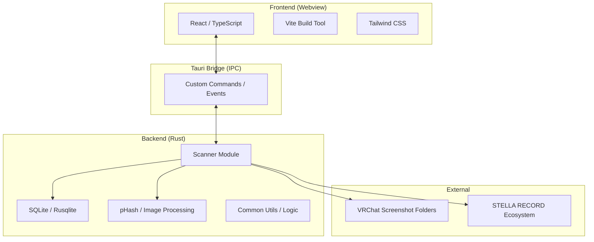

# Alpheratz システム仕様詳解

## 1. システム概要
Alpheratz（アルフェラッツ）は、VRChat ユーザー向けの写真管理・ワールド情報紐付けアプリケーションです。STELLAProject エコシステムの一翼を担い、撮影されたスクリーンショットからメタデータを抽出し、類似画像検索やワールド情報による整理を提供します。

### 1.1 基本コンセプト
- **自動化**: 特定のフォルダをスキャンし、写真と撮影ワールドを自動的に紐付ける。
- **高速性**: 数千枚規模の写真データに対しても、SQLite と仮想スクロールを活用して軽快な閲覧を可能にする。
- **美観**: 「Stargazer UI」に基づいた深宇宙・グラスモーフィズムデザインの採用。

---

## 2. システムアーキテクチャ
本システムは **Tauri** フレームワークを採用しており、Rust による堅牢なバックエンドと、React/TypeScript による柔軟なフロントエンドで構成されています。



---

## 3. バックエンド・実装詳解 (Rust)

### 3.1 `main.rs`: エントリポイントとパニックフック
アプリケーションの起動と致命的エラーの制御を担います。特筆すべきは Windows ネイティブの `MessageBoxW` を使用したパニックフックの実装です。
- **役割**: サブシステム設定による UI 無しのサイレントクラッシュを防止し、クラッシュ情報を `info.log` に書き出した上でユーザーに通知します。

### 3.2 `lib.rs`: コマンドブリッジ
フロントエンドとの通信窓口となる Tauri コマンドが集約されています。
- `initialize_scan`: スキャンの開始。`tokio::spawn` を用いて非同期で実行。
- `get_photos`: 日付、ワールド名、部分一致/完全一致などの複雑なクエリによる検索を担当。
- `get_rotated_phashes`: 類似度計算用の回転ハッシュ生成。

### 3.3 `scanner.rs`: スキャンエンジンとメタデータ解析
本システムの心臓部です。
- **再帰的スキャン**: 指定されたフォルダを再帰的に巡回し、正規表現 `VRChat_...` に一致するファイルを収集します。
- **PNG iTXt チャンク解析**: VRChat のスクリーンショットに含まれる埋め込みメタデータをバイナリレベルで解析し、ワールドID、ワールド名、インスタンス情報を抽出します。
- **pHash アルゴリズム**: `image_hasher` を使用。画像の輝度変化に基づいて 64bit のハッシュを生成し、回転耐性を持たせるために 4 方向のハッシュを保持します。
- **キャンセレーション管理**: `AtomicBool` を用いたスレッドセーフな中断処理。

### 3.4 `db.rs`: データベース管理
SQLite (`rusqlite`) を使用。
- **スキーマ**: `photos` テーブルを中心に、ファイル名（一意）、パス、撮影日時、ワールド情報、pHash、メモを管理。
- **パフォーマンス最適化**: `PRAGMA journal_mode = WAL` や `synchronous = NORMAL` を設定。
- **拡張性**: `photo_embeddings` テーブルを定義済み（将来の AI 特徴量検索への布石）。

### 3.5 `stella_record_ext.rs`: エコシステム連携
STELLAProject の親アプリ（STELLA RECORD）との連携。
- `pleiades.json` への本アプリ情報の登録。レジストリから STELLA RECORD のインストール先を特定し、動的にパスを書き込みます。

---

## 4. フロントエンド・実装詳解 (React / TS)

### 4.1 状態管理とカスタム Hooks
ロジックを Hooks に分離することで、コンポーネントの肥大化を防いでいます。
- `useScan`: スキャン状態（進捗率、現在の処理フォルダ等）を Tauri イベント経由で同期。
- `usePhotos`: 検索条件の変更をトリガーとした写真リストのリアクティブな取得。
- `useScroll`: 仮想スクロールのスクロール位置管理と、月別のナビゲーション位置計算。
- `useGridDimensions`: `ResizeObserver` を使用し、ウィンドウ幅に応じて動的にカラム数を算出。

### 4.2 UI コンポーネント
- **Virtual Grid**: `react-window` を使用。数千枚の写真があっても、画面外の DOM をレンダリングしないことでメモリ負荷を抑制。
- **Custom Scrollbar**: 標準スクロールバーを隠し、年・月インジケータ付きの独自スクロールバーを実装。ドラッグによる直感的な移動をサポート。
- **PhotoModal**: 写真の詳細表示、メモ保存、および「類似写真の提案」機能。pHash のハミング距離 (Hamming Distance) を算出し、類似度順にソートして提示。

---

## 5. データモデル

### 5.1 Photo オブジェクト
```typescript
interface Photo {
    photo_filename: string;
    photo_path: string;
    world_id: string | null;
    world_name: string | null;
    timestamp: string;      // ISO 8601 形式
    memo: string;
    phash: string | null;   // 類似検索用
}
```

---

## 6. ビルド・デプロイ構成

### 6.1 NSIS インストーラー
`tauri.conf.json` の設定に基づき、日本語対応のインストーラーを生成。
- **Stargazer Branding**: ヘッダー画像 (`headerUI.bmp`) やサイドバー画像 (`wizardUI.bmp`) を統合し、インストール時から一貫したブランド体験を提供。

### 6.2 バッチスクリプト
- `build-alpheratz.bat`: 既存プロセスのクリーニング後、リリースビルドを実行。
- `dev-alpheratz.bat`: 開発用デバッグサーバーの起動。

---

## 7. 特筆すべき技術的課題と今後の展望 (Roadmap)

これまでの詳細調査（現課題1-4）に基づき、以下の改善が計画されています。
1.  **非同期 I/O の最適化**: バックエンドでのブロッキング処理（画像スキャン・回転）を `spawn_blocking` へ移行し、UI の完全なフリーズ防止を実現する。
2.  **型安全性の強化**: フロントエンドの `any` キャストの排除と、Tauri コマンドの型定義自動生成の活用。
3.  **セキュリティ向上**: CSP の厳格化と、パス情報の抽象化。
4.  **UX の改善**: フォルダ未設定時の警告強化、多言語化対応 (i18n)、アクセシビリティ（キーボード操作対応）の改善。

---

## 8. 結論
Alpheratz は、Rust の高い処理能力と React の表現力を最適に組み合わせた、モダンな VRChat ツールです。
単なる写真ビューアに留まらず、メタデータ解析と類似度検索を組み合わせることで、ユーザーの「思い出の探索」に革命をもたらす設計となっています。
本ドキュメントに記載された仕様は、STELLAProject の高い品質基準を体現するものであり、今後の継続的なアップデートの基盤となります。
