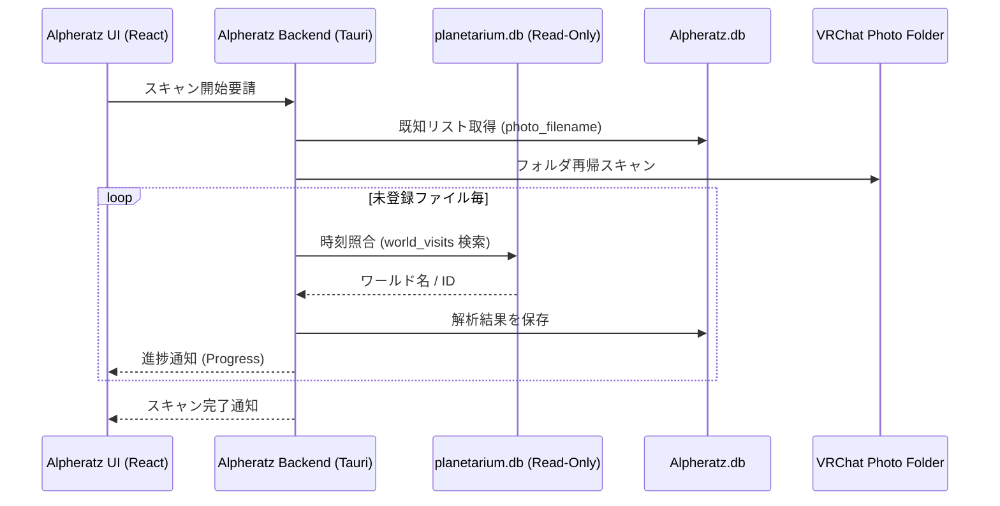

# 内部設計書：Alpheratz (VR写真・ワールド紐付け解析エンジン)

## 1. 概要
Alpheratz（アルファラッツ）は、VRChatで撮影された写真ファイルと、Planetariumが構築した滞在履歴データベース（`planetarium.db`）を照合し、写真に「どのワールドで撮影されたか」というメタデータを紐付ける解析エンジンである。

## 2. コア・ポリシー
- **非破壊解析**: 写真ファイル本体（Exif等）は一切書き換えず、対応情報を独立したデータベース（`Alpheratz.db`）で管理する。
- **読み取り専用連携**: Planetariumのデータベースに対しては `SQLITE_OPEN_READ_ONLY` で接続し、他モジュールの整合性に影響を与えない。
- **高速再スキャン**: 既に解析済みの写真は `HashSet` でキャッシュし、新規ファイルのみを差分解析することで、数万枚のフォルダに対しても高速な同期を実現する。
- **ローカル完結**: 解析・サムネイル生成・メタデータ保持のすべてをローカル環境で行い、外部APIやクラウドへの依存を排除する。

## 3. 処理フロー

### 3.1 写真スキャン (`InitializeScan`)
1.  **DB初期化**: `Alpheratz.db` を WAL モードで開き、`photos` テーブルとインデックスを作成。
2.  **既知ファイル収集**: DBから登録済みのファイル名を `HashSet` に読み込む。
3.  **再帰的探索**: 指定された写真フォルダ（デフォルトはVRChatログと同階層）を再帰的にスキャン。
4.  **新規ファイル特定**: 正規表現 `VRChat_YYYY-MM-DD_HH-MM-SS.mmm` にマッチし、かつDB未登録のものを抽出。

### 3.2 メタデータ紐付け解析
1.  **Planetarium連携**: `planetarium.db` を読み取り専用でオープン。
2.  **時刻照準**: 写真のファイル名から得られる日時と、Planetariumの `world_visits` テーブルを照合。
    - 条件: `join_time <= photo_time AND (leave_time IS NULL OR leave_time >= photo_time)`
3.  **DB登録**: 解析したワールド名、ワールドID、タイムスタンプを `Alpheratz.db` に保存。

### 3.3 サムネイル生成
1.  **キャッシュ利用**: `%LOCALAPPDATA%...\app\Alpheratz\thumbnail_cache` を参照。
2.  **生成ロジック**: ファイルが存在しない場合のみ `image` クレートを使用して 360x360 サイズに縮小、JPG形式でキャッシュを生成。

## 4. 実行環境設計
- **参照元 (Planetarium)**: `app/Planetarium/planetarium.db` (読み取りのみ)
- **データベース**: `%LOCALAPPDATA%\CosmoArtsStore\STELLARECORD\app\Alpheratz\Alpheratz.db`
- **キャッシュパス**: `%LOCALAPPDATA%\CosmoArtsStore\STELLARECORD\app\Alpheratz\thumbnail_cache\`
- **対応拡張子**: `.png`, `.jpg`, `.jpeg`

## 5. シーケンス・ダイアグラム

## 6. 特筆事項：なぜこの構成か
- **他モジュールとの疎結合**: PlanetariumのDB構造を知っているが、書き込みは行わない「依存のみ」の関係に留めることで、Planetarium側の仕様変更時も影響範囲を最小化できる。
- **ファイル名ベースの信頼**: 写真のタイムスタンプとして「OSの作成日時」ではなく「VRChatが出力するファイル名（秒・ミリ秒まで精密）」を採用することで、ファイルのコピーや移動後も正確な紐付けを維持する。
- **パフォーマンスと拡張性**: 写真一覧のフィルタリングを SQLite レベルで行う（`world_name` 等へのインデックス）ことで、膨大な写真コレクションに対しても快適な検索性能を確保。
