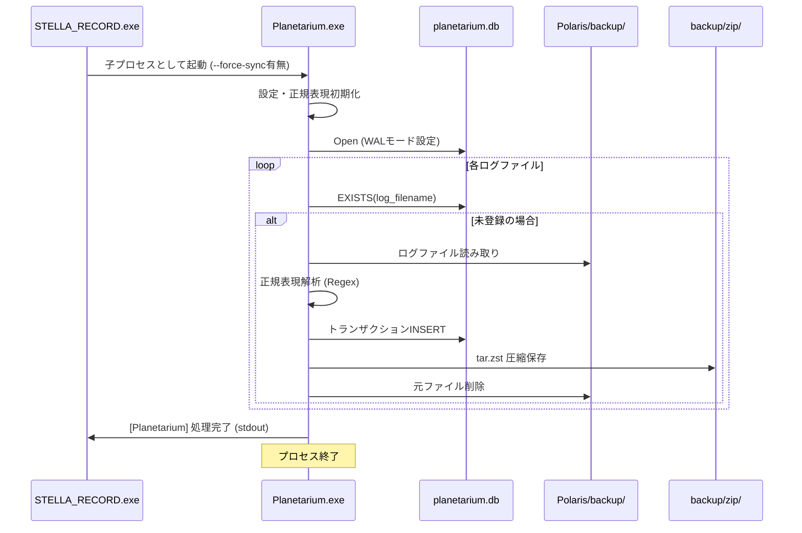

# 内部設計書：Planetarium (ログデータベース構築エンジン)

## 1. 概要
Planetariumは、Polarisによって保全されたVRChatの生ログファイルを解析し、SQLiteデータベース (`planetarium.db`) を構築・更新するコアエンジンである。 
さらに、処理済みのログを `tar.zst` 形式で圧縮アーカイブ化し、ストレージ容量の節約と長期保存を両立させる。

## 2. コア・ポリシー
- **一方向データフロー**: 常に「生ログ ➔ データベース ➔ 圧縮アーカイブ」の順で処理を行う。元の生ログの改変は行わない。
- **高速解析性能**: `once_cell` による正規表現の静的コンパイルと、SQLiteのトランザクション、WALモードの採用により、数千行のログ解析をミリ秒単位で完了させる。
- **プライバシー保護**: `enableUserTracking` 設定により、個人特定情報の保存レベルを制御。Privacyモード時は他者の `usr_ID` を一切保存しない。
- **堅牢な差分管理**: `log_filename` をUNIQUEキーとし、解析前に `EXISTS` 句で重複チェックを行うことで、二重登録を物理的に防止する。

## 3. 処理フロー

### 3.1 通常モード（差分取得）
1.  **設定読込**: `PlanetariumSetting.json` を読み込み、処理対象ディレクトリを確認。
2.  **ファイル収集**: 収集フォルダ内の `output_log_*.txt` を列挙。
3.  **解析ループ**:
    - DB上で当該ファイルが「パース済み」かを確認。
    - 未処理の場合、トランザクションを開始し、行単位で解析（正規表現マッチング）。
    - 各種テーブル（sessions, visits, players等）へデータを登録。
4.  **事後処理**: 解析成功後、ログファイルを `tar.zst` 化して `zip/` フォルダへ移動し、元の `.txt` を削除。

### 3.2 強制Syncモード (`--force-sync`)
1.  **アーカイブ展開**: `zip/` 内の全 `.tar.zst` を `tmp_sync/` フォルダへ一時展開。
2.  **再解析**: 展開されたファイルを通常モードと同様のロジックで再パース（DBに不足しているデータのみ補完）。
3.  **クリーンアップ**: 全処理完了後、`tmp_sync/` を完全に削除。

## 4. 実行環境設計
- **収集元 (Source)**: `app/Polaris/backup/` (デフォルト)
- **データベース**: `%LOCALAPPDATA%\CosmoArtsStore\STELLARECORD\app\Planetarium\planetarium.db`
- **保存圧縮形式**: `zstd` (Compression Level 1) ＋ `tar`
- **ログアクセラレーション**: SQLトランザクション及び `PRAGMA journal_mode = WAL`

## 5. シーケンス・ダイアグラム

## 6. 特筆事項：責務境界と「閉じ方」
- **運び屋（Polaris）と門番（Planetarium）**: 
    - Polarisは「状態（履歴）」を持たないことで極小化を維持する。そのため、Planetariumがファイルを消してもPolarisはそれを「未到達」と判断して再配送する。
    - Planetariumはこの**「無限コピー・削除ループ」を仕様として完全に許容**する。
- **物理的な整合性の維持**: 
    - PlanetariumはSQLiteの `UNIQUE` キー（`log_filename`）を絶対的な門番とし、何度ファイルが届いてもDBを汚染させない。
    - 重複ファイルを発見した場合は直ちに削除（またはアーカイブ）し、`backup/` 領域を常に最小化させる。
- **ファイルロックの回避**: Windows `SharedRead` モードでのログアクセスにより、Polarisのコピー中であってもデータの読み取り・整合性チェックを可能にしている。
- **Rich Text の考慮**: ログ内の Unity Rich Text タグ（`<color=...>`）を正規表現側で考慮しており、装飾されたログも正確に解析可能。

この「運び屋は考えない。門番だけが考える」という非対称的な設計により、システム全体の堅牢性（疎結合）を実現している。
