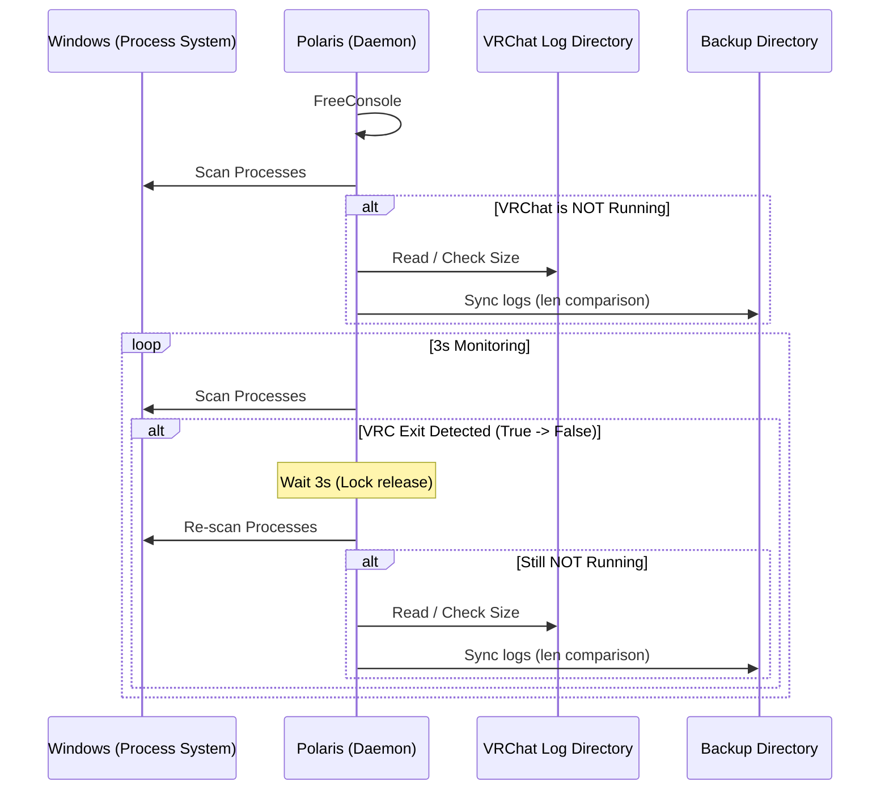

# 内部設計書：Polaris (極小化ログバックアップ・デーモン)

## 1. 概要
Polarisは、VRChatのセッション終了時およびシステム起動時に特化した、超軽量なログ収集（バックアップ）常駐プロセスである。
「VRChatが稼働していない瞬間のみログを安全にコピーする」という単一責力を追求し、外部設定やログ出力すら持たない極限のミニマリズムで構築される。

## 2. コア・ポリシー
- **完全自己完結**: 設定ファイル (`settings.json`)、ロガーモジュール、トレイアイコン、OS再起動予約機能をすべて排除。`main.rs` 1ファイルのみで全機能を完結させる。
- **実行中干渉のゼロ化**: VRChatプロセスが1つでも存在する場合、ログファイルへのアクセス（読み取り・コピー）を物理的に遮断する。
- **背景実行の徹底**: `windows_subsystem` ＋ `FreeConsole()` により、コマンドラインから起動された場合でもコンソールを即座に解放し、完全なバックグラウンド動作を行う。

## 3. 処理フロー（最小構成）

### 3.1 起動フェーズ
1.  **コンソール解放**: `FreeConsole()` を呼び出し、バックグラウンドへ移行。
2.  **プロセス・スキャン**: `sysinfo` を使用して現在の実行プロセスを確認。
3.  **初期同期判定**:
    - **VRChat未起動時**: 直ちに `backup/` ディレクトリへログを同期。
    - **VRChat起動中時**: 同期を行わずに監視モードへ移行（ファイルの安全性を優先）。

### 3.2 監視フェーズ (3秒サイクル)
VRChatの起動状態を管理するフラグ（`vrchat_was_running`）を使用して、状態遷移を捉える。

- **VRC起動を検知 (`False -> True`)**:
    - フラグを `true` に更新。**この間、バックアップは一切行わない。**
- **VRC終了を検知 (`True -> False`)**:
    - フラグを `false` に更新。
    - VRChatのプロセス消失後、ファイルロック解放を待つため**3秒追加待機**する。
    - 再度、VRChatが起動していないことを確認した上で `sync_logs()` を実行し、増分同期（`len` 比較）を行う。

## 4. 実行環境設計
- **収集元 (Source)**: `%APPDATA%\..\LocalLow\VRChat\VRChat\output_log_*.txt`
- **保管先 (Destination)**: `%LOCALAPPDATA%\CosmoArtsStore\STELLARECORD\app\Polaris\backup\`
- **監視周期**: 3000ms

## 5. シーケンス・ダイアグラム

## 6. 特筆事項：なぜこの構成か
- **ファイルロックの完全回避**: 実行中のVRChatがログファイルをロックしているタイミングでのコピーエラーを、3秒の猶予とプロセス監視によって構造的に排除。
- **ゼロ・メンテナンス**: 設定ファイルを持たないため、ユーザー設定の不整合や破損によるクラッシュが発生しない。仕様変更時は `main.rs` を差し替えるのみ。
- **極低負荷**: プロセス名の一致確認のみを3秒おきに行うため、現代のPC環境において計測困難なレベルの低負荷を実現。
