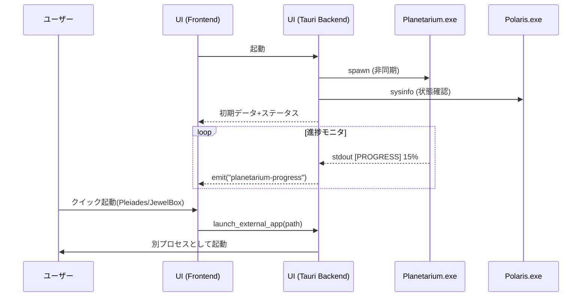

# 内部設計書：STELLA RECORD (統合ハブ UI / ランチャー)

## 1. 概要
STELLA RECORDは、本プロジェクトの全ツール群を一括管理する統合ユーザーインターフェース兼アプリケーションランチャーである。
Tauri（Rust + React）を採用し、常駐デーモン (Polaris) の監視、DBエンジン (Planetarium) の制御、自社および外部アドオンの起動ハブとしての機能を提供する。

## 2. コア・ポリシー
- **UI優先（ノンブロッキング）**: バックエンド処理（Planetariumの解析など）が進行中であっても、UIは即座に起動し操作可能であることを維持する。
- **子プロセスによる責務分離**: 重い解析処理や常駐監視をUIプロセスに持たせず、独立した `.exe` を管理（起動・監視・KILL）する役割に徹する。
- **設定の中央管理**: 各ツールの設定 (`JSON`) を `setting/` フォルダへ集約し、UI側からの一括編集・保存を可能にする。
- **拡張性（カード型UI）**: 自社ツール (Pleiades) と外部ツール (JewelBox) を共通のJSON形式で定義し、カードUIとして動的に表示するランチャー機能を持つ。

## 3. 処理フロー

### 3.1 起動シーケンス
1.  **UI初期化**: Tauriバックエンドと Reactフロントエンドが起動。
2.  **Planetarium 起動**: `Planetarium.exe` を非同期で子プロセスとして自動起動（最新ログの自動DB化）。
3.  **Polaris 状態確認**: `sysinfo` で `Polaris.exe` の存否を確認し、UIに稼働ステータスを表示。
4.  **JSON読込**: `PleiadesPath.json` / `JewelBoxPath.json` をパースし、ランチャー画面を構築。

### 3.2 モジュール管理
- **Polaris 管理**: 
    - ステータス監視、スタートアップ登録（レジストリ `HKCU\Run` への書き込み）。
    - 手動起動が必要な場合のみ `Polaris.exe` をキックする。
- **Planetarium 管理**:
    - 通常起動 (`launch`)、強制Sync (`--force-sync`) 起動の制御。
    - `stdout` をパイプで受け取り、進捗率 (`[PROGRESS]`) をフロントエンドへ `emit` (通知) する。
    - 無限ループ防止や手動停止のための `kill()` 制御 (Cancel)。

### 3.3 ランチャ機能
1.  **カード生成**: 指定されたディレクトリの JSON から `name`, `description`, `path` を読み込み。
2.  **外部起動**: `Command::new(path).spawn()` により、UIとライフサイクルを切り離してツールを起動。

## 4. 実行環境設計
- **設定パス**: `%LOCALAPPDATA%\CosmoArtsStore\STELLARECORD\setting\`
- **アプリパス**: `STELLARECORD/app/` (Polaris, Planetarium, Alpheratz)
- **UIフレームワーク**: Tauri v2, React v18, Vite
- **通信方式**: Tauri Invoke (Remote Procedure Call) ＋ Events (Event Emission)

## 5. シーケンス・ダイアグラム

## 6. 特筆事項：なぜこの構成か
- **クラッシュ耐性の向上**: 子プロセス (Planetarium等) が何らかの理由でクラッシュしても、メインUIは影響を受けず、再試行やログ確認などのリカバリ操作をユーザーに提供し続けることができる。
- **疎結合の維持**: UIは各ツールのパスと起動引数、そして共通の JSON 構造のみを知っていればよいため、個別のツールをアップデート（例：Polarisを127行の軽量版に差し替え）してもUI自体の修正を最小限に抑えられる。
- **SPAによるシームレスな体験**: 各ツール（Polaris, Planetarium, Alpheratz）の操作画面を1つのウィンドウ内で React Router 等により切り替えることで、複数のツールを使い分けている感覚を排除し、1つの統合環境として提供する。
