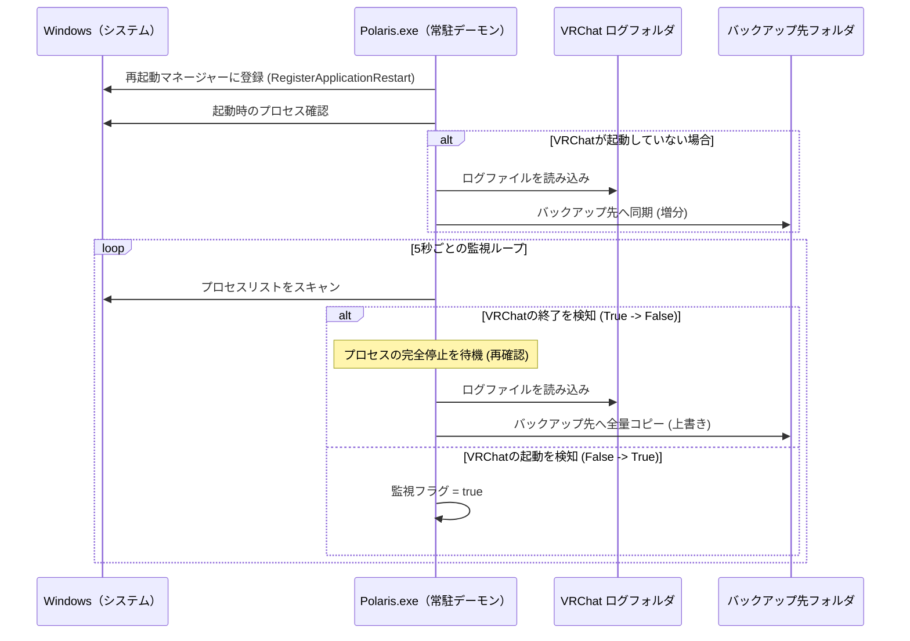

# 1. 改訂履歴

| バージョン | 日付 | 内容 | 承認 |
| :--- | :--- | :--- | :--- |
| 1.0.0 | 2026-02-28 | 新規作成（極小化構成） | |

# 2. はじめに
本ドキュメントは、VRChatのセッション終了時およびシステム起動時に特化した超軽量なログ収集プロセスの内部構造を定義するものである。

# 3. 基本方針
- **完全自己完結**: 設定ファイル、ロガー、UIを排除し、`main.rs` 1ファイルで全機能を完結させる。
- **低負荷・非干渉**: VRChat稼働中のログアクセスを物理的に遮断し、アイドル時のリソース消費を極限まで抑える。

# 4. システム構成

## 4.1 実行環境
- **OS**: Windows 10/11 (x64)
- **言語**: Rust
- **依存ライブラリ**: `sysinfo`, `winapi`

## 4.2 パス定義
- **収集元**: `%APPDATA%\..\LocalLow\VRChat\VRChat\output_log_*.txt`
- **保管先**: `%LOCALAPPDATA%\CosmoArtsStore\STELLARECORD\app\Polaris\backup\`

# 5. 処理詳細

## 5.1 起動フェーズ
1. **OS自動再起動登録**: `RegisterApplicationRestart` を呼び出し、Windows Update等の再起動後も自動復帰するよう登録する。
2. **プロセス状態確認**: 起動直後に `sysinfo` でVRChatの有無を確認する。
3. **条件付きバックアップ**:
    - VRChat未起動時：即座にログを同期する。
    - VRChat起動中：コピーを行わずに監視を開始する。

## 5.2 監視・バックアップフェーズ
5秒ごとのポーリングにより、以下の状態遷移を捕捉する。

- **VRChat終了検知**: 実行フラグが `true` から `false` に変わった際、プロセスの完全停止を待ってからログを同期（`sync_logs`）する。
- **VRChat起動検知**: 実行フラグを `true` に設定し、バックアップ処理をサスペンドする。

# 6. 運用・保守
- **ファイルロック**: VRChat非稼働時のみ動作するため、共有違反の発生を構造的に回避している。
- **メモリ管理**: 動的なヒープ確保を最小限に抑え、長期間の常駐に耐える設計とする。

# 7. 処理フロー図（Mermaid）
*※docx出力時は画像に変換して参照することを推奨*

